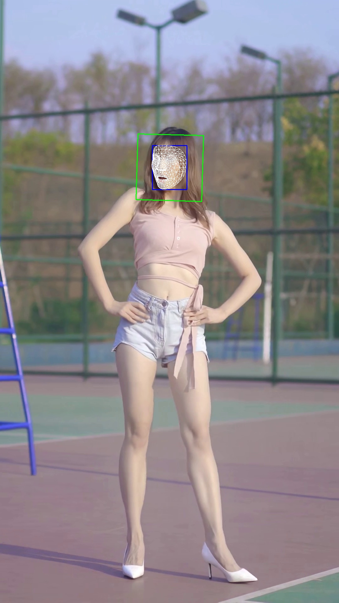

# MediaPipeFaceMesh

python3.7  
mediapipe==0.8.7

* trakcer模式  
   第一帧使用人脸检测，后面的视频帧使前一帧的landmark计算roi，送入人脸关键点模型，效果较稳定，前后一致性较好，与offical模式基本一致
* static模式  
   每帧都使用人脸检测，然后得到roi送入人脸关键点模型，效果尚可，前后一致性稍差(抖动稍大)
* offical模式  
   使用mediapipe官方提供的代码


tracker模式
```
python mediapipefacemesh_tracker.py
```

static模式
```
python mediapipefacemesh_static.py
```

offical模式
```
python facemesh.py
```
* demo



